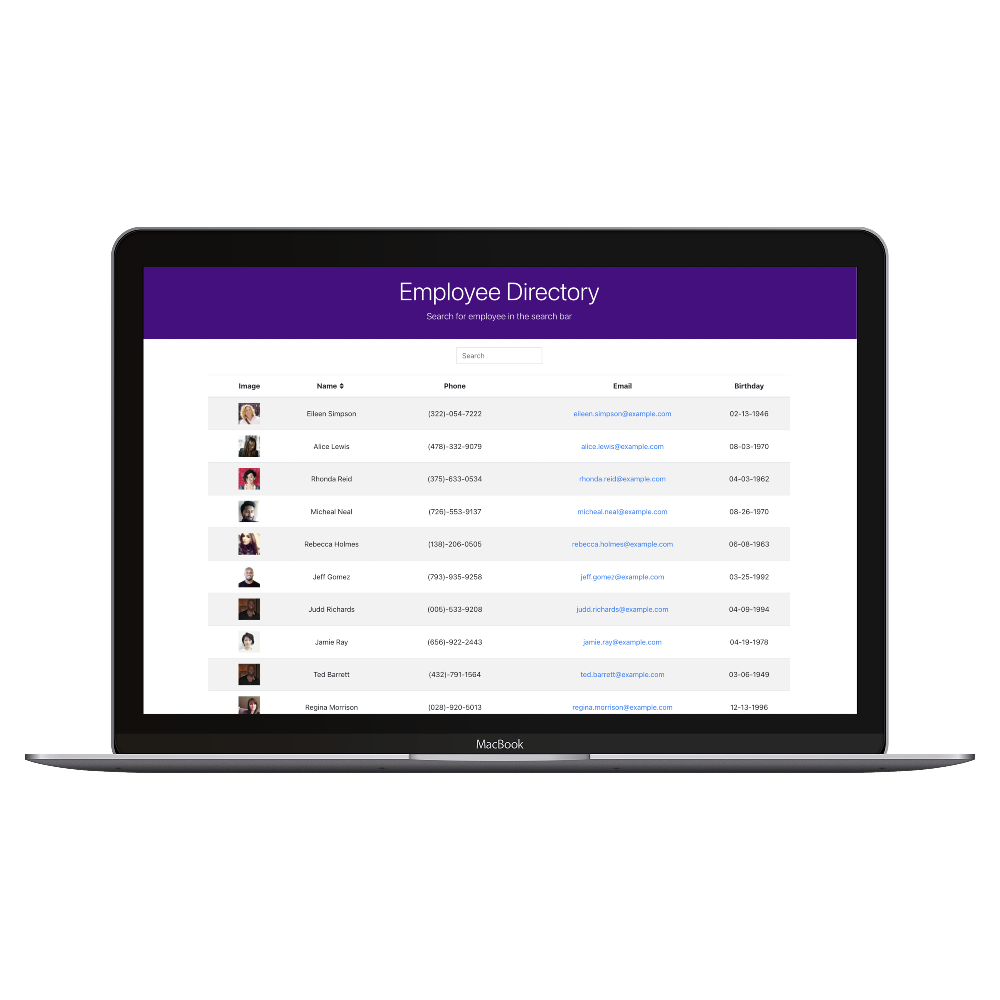
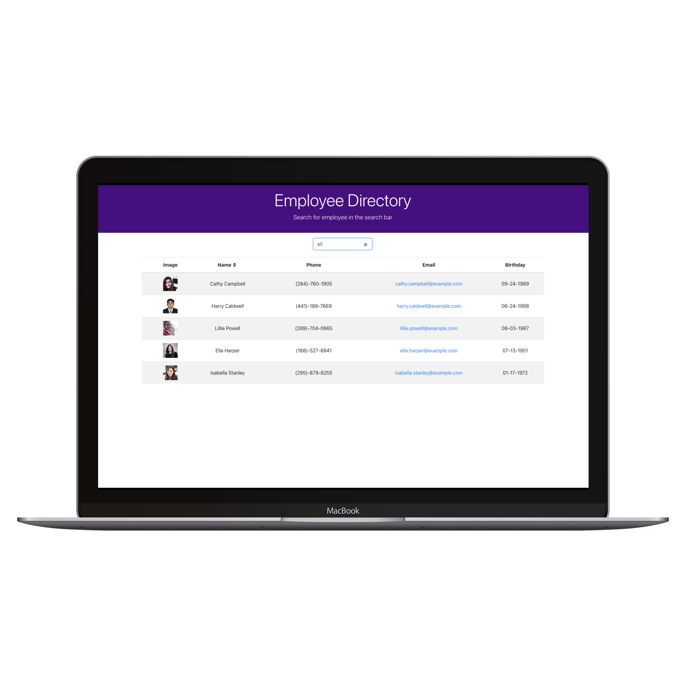

# Employee Directory


# Description

Employee directory application created using react where user can view employee data, search employee or sort employee by name.
This project was bootstrapped with [Create React App](https://github.com/facebook/create-react-app).

**[Deployed Website](https://gaurikhandke.github.io/employee-directory/)**

# User Story

```
As a user, I want to be able to view my entire employee directory at once so that I have quick access to their information.
```

# Business Context

```
An employee or manager would benefit greatly from being able to view non-sensitive data about other employees. It would be particularly helpful to be able to filter employees by name.
```

# Screenshot

|Employee Directory Home Page| Search Employee
|--|--
||

# Installation

1. Clone this repository to your local machine.

2. Run `npm install` to install dependencies required for this project.

3. Run command `npm start` : Runs the app in the development mode. Open [http://localhost:3000](http://localhost:3000) to view it in the browser.

# Technology

1. [React](https://reactjs.org/): React.js is a JavaScript library that can be used to build user interfaces. With React, users can create reusable components, and these components display data as it changes over time.

2. [Create React App](https://facebook.github.io/create-react-app/docs/getting-started): Create React App is an officially supported way to create single-page React applications. It offers a modern build setup with no configuration.

# Features

1. This project was bootstrapped with [Create React App](https://github.com/facebook/create-react-app).

2. User can view all employees data.

3. User can search employee as well as sort employees by name.

4. Project is deployed on github pages.

# License

This project is licensed under MIT License.

# Contribution

Please let me know how I can improve this project. Issues and pull requests are always welcome.

# Questions 

If you have any questions about the repo, 
contact me directly at [Email](mailto:khandkegauri@gmail.com).


